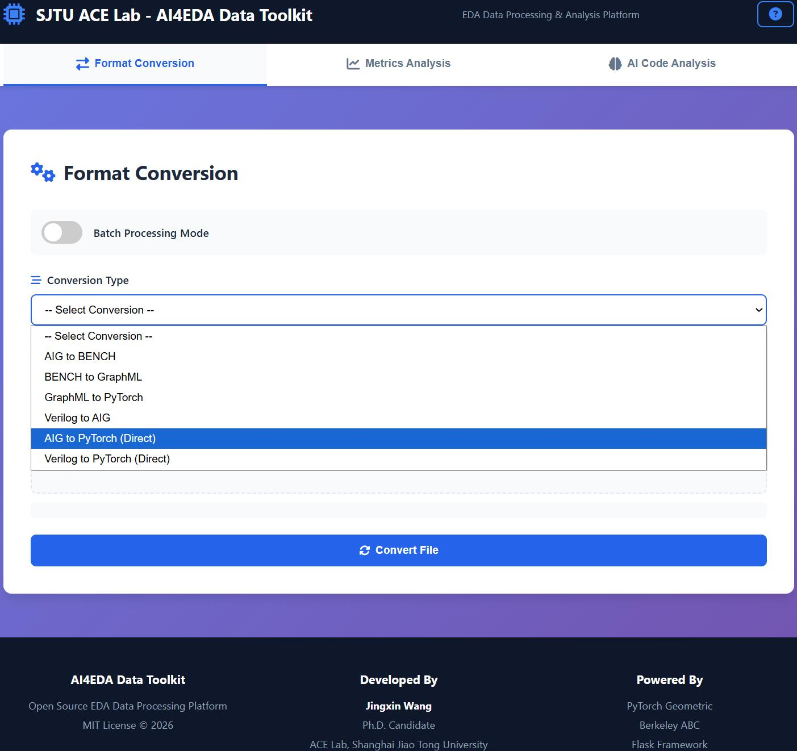
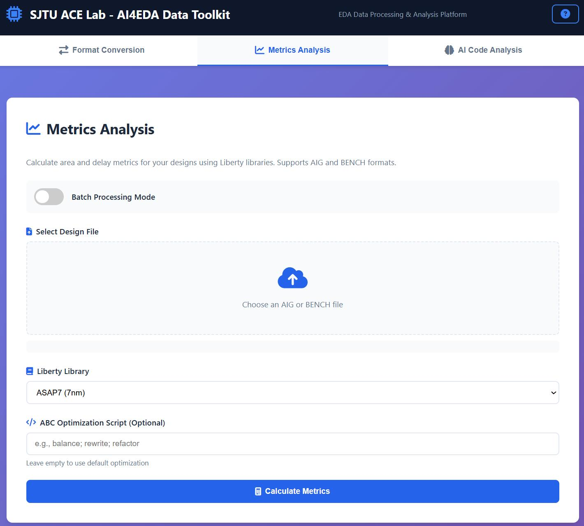
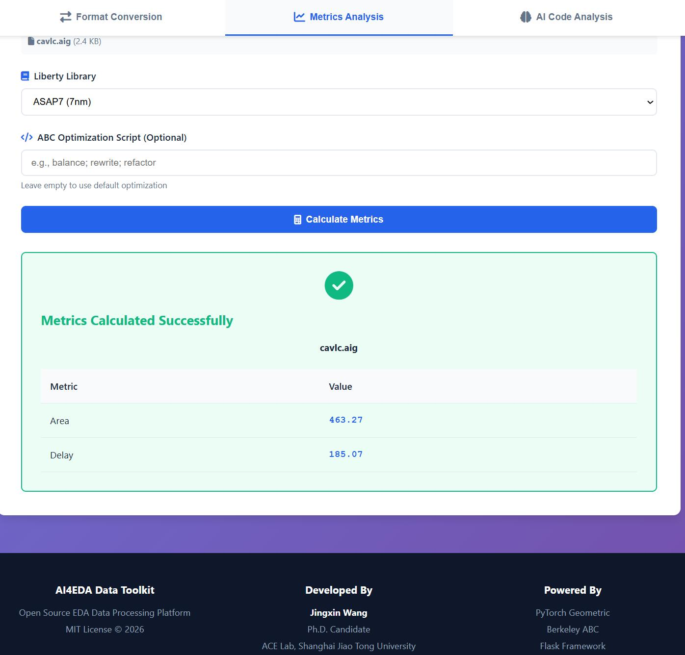
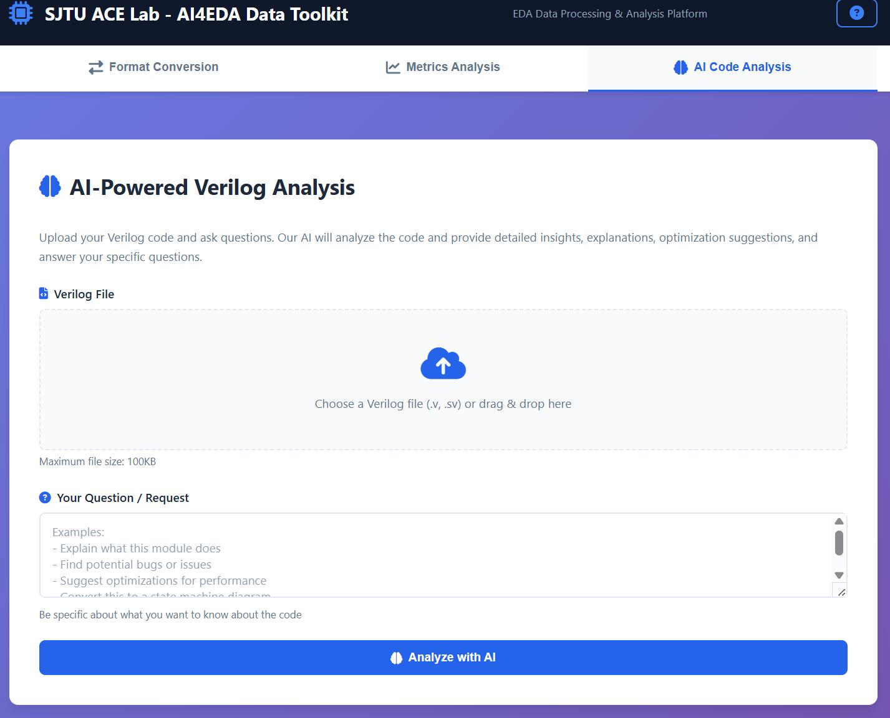
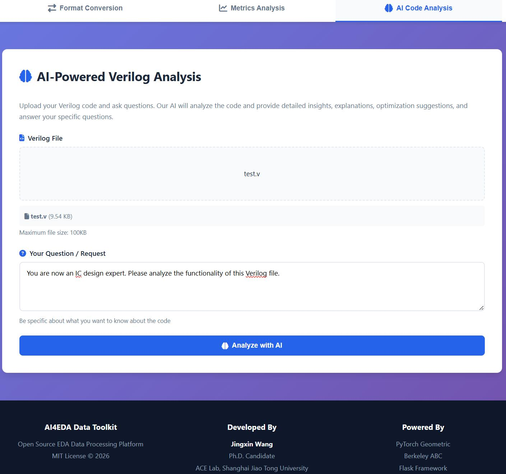
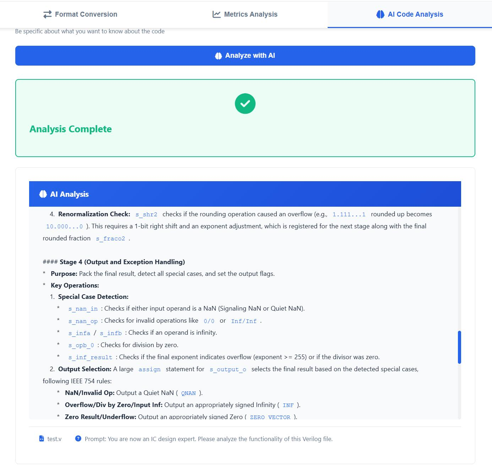

# AI4EDA Data Toolkit

Un conjunto de herramientas de código abierto exhaustivo para el procesamiento de datos de EDA (Electronic Design Automation) y la conversión de formatos, diseñado específicamente para aplicaciones de AI4EDA.

**Desarrollado por**: Jingxin Wang (jingxin.wang@sjtu.edu.cn)  
**Afiliación**: ACE Lab, Universidad Jiao Tong de Shanghai  
**Licencia**: Licencia MIT

## 🎥 Vídeos de Introducción al Proyecto

Mira nuestros vídeos introductorios detallados para conocer las características, capacidades y cómo empezar a utilizar el AI4EDA Data Toolkit:

<div align="center">

### 📥 Ver Vídeo Web

[-4A90E2?style=for-the-badge&logo=github&logoColor=white)](https://github.com/959AI994/AI4EDA-OpenABC-Data-Toolkit/raw/main/video/Web-Video.mp4)


### 📥 Ver Vídeo CLI

[-FF6B6B?style=for-the-badge&logo=github&logoColor=white)](https://github.com/959AI994/AI4EDA-OpenABC-Data-Toolkit/raw/main/video/CLI-Video.mp4)

**Haz clic en los botones anteriores para descargar y ver los vídeos**

<!-- [](https://bf.ink/s/1njsy3?password=2037)

*Contraseña de descarga en la nube: `2037`* -->

</div>

## Visión

A medida que la inteligencia artificial continúa revolucionando la Automatización Electrónica de Diseño (EDA), existe una creciente necesidad de herramientas de procesamiento de datos estandarizadas y accesibles que cierren la brecha entre los flujos de trabajo de EDA tradicionales y los marcos modernos de IA/ML. El AI4EDA Data Toolkit se ha construido con la visión de:

- **Democratizar la investigación de AI4EDA**: Proporcionar a investigadores e ingenieros herramientas fáciles de usar para convertir, procesar y analizar datos de EDA en formatos compatibles con IA.
- **Construir un ecosistema de datos enriquecido**: Ofrecer diversos tipos y formatos de datos para soportar varias aplicaciones de AI4EDA, desde la optimización de síntesis lógica hasta la exploración del espacio de diseño.
- **Habilitar la innovación rápida**: Permitir que la comunidad experimente rápidamente con diferentes representaciones de datos y enfoques de ML sin quedar atrapada en el preprocesamiento de datos.
- **Fomentar la colaboración abierta**: Crear una plataforma extensible donde se puedan integrar fácilmente nuevos convertidores, métricas y herramientas de análisis impulsadas por IA.

Este repositorio sirve como base para la comunidad AI4EDA, proporcionando herramientas probadas para tareas comunes de procesamiento de datos, manteniendo la flexibilidad suficiente para adaptarse a casos de uso emergentes. Nos comprometemos a expandir continuamente el toolkit con más tipos de datos, funciones impulsadas por IA y capacidades de análisis a medida que el campo evolucione.

## Navegación Rápida

📦 **Elige tu interfaz:**
- 🌐 [**Versión Web**](#web-version) - Interfaz de navegador intuitiva con análisis impulsado por IA (Recomendado para tareas rápidas)
- ⌨️ [**Versión CLI**](#features-cli-version) - Herramientas de línea de comandos para automatización y procesamiento por lotes (Recomendado para flujos de trabajo a gran escala)

Ambas versiones proporcionan la misma funcionalidad potente; ¡elige según tu preferencia de flujo de trabajo!

## Web Version

El AI4EDA Data Toolkit proporciona una interfaz web moderna y fácil de usar para el procesamiento de datos de EDA. Accede a todas las funciones a través de tu navegador con una interfaz intuitiva.

**URL de la Interfaz Web**: http://localhost:8080 

### Función 1: Conversión de Formatos

Convierte entre diferentes formatos de archivos de EDA con soporte de arrastrar y soltar.



**Conversiones Soportadas:**
- AIG a BENCH
- BENCH a GraphML
- GraphML a PyTorch Geometric (.pt)
- Verilog a AIG
- AIG a PyTorch (Directo)
- Verilog a PyTorch (Directo)

**Resultados de la Conversión:**

.jpg)

.jpg.jpg)

### Función 2: Análisis de Métricas

Calcula métricas de área y retardo para tus diseños utilizando librerías Liberty.



**Características:**
- Computación de área y retardo
- Soporte para librerías Liberty personalizadas (ASAP7 incluida)
- Scripts de optimización de ABC personalizados
- Soporte para procesamiento por lotes

**Resultados de las Métricas:**



### Función 3: Análisis de Verilog Impulsado por IA

Analiza tu código Verilog utilizando la IA de DeepSeek para la comprensión del código, detección de errores y sugerencias de optimización.



**Capacidades:**
- Explicación y documentación del código
- Detección de errores y problemas potenciales
- Sugerencias de optimización
- Análisis de patrones de diseño
- Preguntas personalizadas sobre tu código

**Análisis de IA en acción:**



**Resultados del Análisis de IA:**



### Primeros Pasos con la Interfaz Web

Para instrucciones detalladas sobre cómo iniciar y utilizar la interfaz web, consulta [web/README.md](web/README.md).


## Features (CLI Version)

- **Conversión de Formatos**
  - Conversión de AIG a BENCH
  - Conversión de BENCH a GraphML
  - Conversión de GraphML a PyTorch Geometric (.pt)
  - Conversión de Verilog a AIG
  - **AIG a PT (directo)** - Conversión en un solo paso de AIG a PyTorch Geometric
  - **Verilog a PT (directo)** - Conversión en un solo paso de Verilog a PyTorch Geometric

- **Cálculo de Métricas**
  - Computación de área y retardo utilizando librerías Liberty
  - Soporte para scripts de optimización de ABC personalizados

- **Generación de Recetas de Síntesis**
  - Generación automática de secuencias de optimización de síntesis
  - Estrategias de optimización personalizables

- **Compatibilidad con PyTorch Geometric**
  - Carga de datos de PyG entre versiones
  - Compatible tanto con formatos antiguos como nuevos de PyG

## Installation

### Requisitos Previos

- Python 3.7+
- NetworkX
- PyTorch
- PyTorch Geometric
- Herramienta ABC (ver [bin/README.md](bin/README.md) para instrucciones de compilación)

### Instalación desde el código fuente

```bash
git clone https://github.com/959AI994/AI4EDA-OpenABC-Data-Toolkit.git
cd AI4EDA-OpenABC-Data-Toolkit
pip install -r requirements.txt
pip install -e .
```

### ⚠️ Importante: Modo de Formato BENCH (Un Solo Clic)

El comportamiento predeterminado ahora es **BENCH a nivel de puerta (gate-level)**.
Aun puedes anular el modo con una variable de entorno:

```bash
export AI4EDA_BENCH_FORMAT=gate   # o: auto / lut
```

Esto funciona para el uso independiente de `ai4eda` y los wrappers que llaman a este toolkit.
También puedes anularlo por comando:

```bash
ai4eda convert aig2bench in.aig out.bench --bench-format gate
ai4eda convert aig2pt in.aig out.pt --bench-format gate
```

Si tu build local de ABC/yosys-abc todavía no puede producir el BENCH a nivel de puerta esperado, entonces aplica un parche al código fuente de ABC como alternativa:

**Ubicación**: `abc/src/base/io/ioWriteBenc.c` (la función `write_bench`)

**Qué cambiar**: Modifica la función para que emita el formato BENCH estándar a nivel de puerta en lugar del formato LUT. Esto implica generalmente ajustar la lógica de selección de formato dentro de la función.

Para instrucciones detalladas, consulta [bin/README.md](bin/README.md).

<!-- ## Project Structure

```
AI4EDA-OpenABC-Data-Toolkit/
├── ai4eda/                    # Main package
│   ├── converters/            # Format converters
│   │   ├── aig_to_bench.py
│   │   ├── bench_to_graphml.py
│   │   ├── graphml_to_pt.py
│   │   ├── verilog_to_aig.py
│   │   ├── aig_to_pt.py       # Direct AIG→PT conversion
│   │   └── verilog_to_pt.py   # Direct Verilog→PT conversion
│   ├── core/                  # Core functionality
│   │   ├── metrics.py         # Area/delay calculation
│   │   └── synthesis_recipe.py
│   ├── utils/                 # Utilities
│   │   └── pyg_loader.py      # PyG compatibility loader
│   └── cli.py                 # Command-line interface
├── bin/                       # Binary tools
│   ├── abc                    # ABC synthesis tool
│   └── yosys                  # Yosys synthesis tool
├── libs/                      # Liberty libraries
│   └── asap7.lib              # ASAP7 library
├── test_data/                 # Test data
│   ├── aig/                   # Sample AIG files
│   ├── verilog/               # Sample Verilog files
│   ├── bench/                 # Generated BENCH files
│   ├── graphml/               # Generated GraphML files
│   └── pt/                    # Generated PT files
└── ai4eda-toolkit             # Main executable script
``` -->

## Usage

Puedes utilizar el toolkit de dos maneras:
1. **🌐 Interfaz Web** (Recomendado para principiantes) - Interfaz basada en navegador y fácil de usar.
2. **⌨️ Interfaz de Línea de Comandos** (CLI) - Para automatización y procesamiento por lotes.

<!-- ### 🌐 Web Interface

#### Starting the Web Server

```bash
cd web/
./start_server.sh
```

Or run in the background as a daemon:

```bash
cd web/
./run_daemon.sh start    # Start server
./run_daemon.sh status   # Check status
./run_daemon.sh stop     # Stop server
./run_daemon.sh restart  # Restart server
```

#### Accessing the Web Interface

Once started, open your browser and navigate to:
- **Local:** http://localhost:5000
- **Network:** http://SERVER_IP:5000

#### Using the Web Interface

1. Select the conversion type from the dropdown
2. Upload your file (drag & drop supported)
3. Click "Convert File"
4. Download the converted file -->

### ⌨️ Interfaz de Línea de Comandos

El toolkit proporciona una interfaz de línea de comandos unificada:

```bash
ai4eda <command> <subcommand> [options]
```

O utiliza el script directo:

```bash
./ai4eda-toolkit <command> <subcommand> [options]
```

### Conversión de Formatos

#### AIG a BENCH

Convertir un solo archivo:
```bash
ai4eda convert aig2bench input.aig output.bench
```

Convertir un directorio por lotes:
```bash
ai4eda convert aig2bench input_dir/ output_dir/ --batch --recursive
```

#### BENCH a GraphML

Convertir un solo archivo:
```bash
ai4eda convert bench2graphml input.bench output.graphml
```

Convertir por lotes:
```bash
ai4eda convert bench2graphml input_dir/ output_dir/ --batch --recursive
```

#### GraphML a PyTorch Geometric

Convertir un solo archivo:
```bash
ai4eda convert graphml2pt input.graphml output.pt
```

Convertir por lotes:
```bash
ai4eda convert graphml2pt input_dir/ output_dir/ --batch --recursive
```

#### Verilog a AIG

Convertir un solo archivo:
```bash
ai4eda convert verilog2aig input.v output.aig
```

Con especificación del módulo superior (top module):
```bash
ai4eda convert verilog2aig input.v output.aig --top-module my_module
```

#### AIG a PT (Directo - Un solo paso)

Convertir AIG directamente al formato PyTorch Geometric sin archivos intermedios:
```bash
ai4eda convert aig2pt input.aig output.pt
```

Mantener archivos intermedios para depuración:
```bash
ai4eda convert aig2pt input.aig output.pt --keep-intermediate
```

Convertir por lotes:
```bash
ai4eda convert aig2pt input_dir/ output_dir/ --batch --recursive
```

#### Verilog a PT (Directo - Un solo paso)

Convertir Verilog directamente al formato PyTorch Geometric:
```bash
ai4eda convert verilog2pt input.v output.pt
```

Con módulo superior y manteniendo archivos intermedios:
```bash
ai4eda convert verilog2pt input.v output.pt --top-module my_module --keep-intermediate
```

Convertir por lotes:
```bash
ai4eda convert verilog2pt input_dir/ output_dir/ --batch --recursive
```

### Cálculo de Métricas

Calcular área y retardo para un archivo AIG:
```bash
ai4eda metrics input.aig --lib libs/asap7.lib
```

Con script de optimización personalizado:
```bash
ai4eda metrics input.aig --lib libs/asap7.lib --opt-script "balance; rewrite; refactor"
```

Procesar por lotes:
```bash
ai4eda metrics input_dir/ --lib libs/asap7.lib --batch
```

### Generación de Recetas de Síntesis

Generar recetas de síntesis:
```bash
ai4eda recipe generate input.aig output_dir/ --num-recipes 100
```

Con librería Liberty:
```bash
ai4eda recipe generate input.aig output_dir/ --num-recipes 100 --lib libs/asap7.lib
```

## Python API

También puedes utilizar el toolkit como una librería de Python:

### Conversión de Formatos

```python
from ai4eda.converters.aig_to_bench import convert_aig_to_bench
from ai4eda.converters.bench_to_graphml import convert_bench_to_graphml
from ai4eda.converters.graphml_to_pt import convert_graphml_to_pt
from ai4eda.converters.aig_to_pt import convert_aig_to_pt
from ai4eda.converters.verilog_to_pt import convert_verilog_to_pt

# Convertir AIG a BENCH
success, msg = convert_aig_to_bench("input.aig", "output.bench")

# Convertir BENCH a GraphML
success, msg = convert_bench_to_graphml("input.bench", "output.graphml")

# Convertir GraphML a PT
success, msg = convert_graphml_to_pt("input.graphml", "output.pt")

# Conversión directa: AIG a PT (un paso)
success, msg = convert_aig_to_pt("input.aig", "output.pt")

# Conversión directa: Verilog a PT (un paso)
success, msg = convert_verilog_to_pt("input.v", "output.pt", top_module="my_module")
```

### Cálculo de Métricas

```python
from ai4eda.core.metrics import calculate_metrics

# Calcular área y retardo
area, delay, msg = calculate_metrics(
    "design.aig",
    lib_path="libs/asap7.lib",
    opt_script="balance; rewrite"
)
print(f"Area: {area}, Delay: {delay}")
```

### Carga de Datos de PyG (Recomendado)

**Mejor Práctica: Utilizar el Auto Loader**
```python
from ai4eda.utils.version_compat import load_pt_auto

# Maneja automáticamente todas las versiones y formatos de PyG
data = load_pt_auto("circuit.pt")

# Extrae atributos específicos de forma segura
x = data.x
edge_index = data.edge_index
```

**Avanzado: Carga específica por versión**
```python
# Para entornos PyG 2.x
from ai4eda.utils.pyg_loader import load_pyg_data_compatible, extract_pyg_attr

data = load_pyg_data_compatible("graph.pt")
edge_index = extract_pyg_attr(data, 'edge_index')
node_type = extract_pyg_attr(data, 'node_type')

# Para entornos PyG 1.x
from ai4eda.utils.pyg_loader_v1 import load_pyg_data_v1

data = load_pyg_data_v1("graph.pt")  # Convierte automáticamente archivos PyG 2.x
```

## Testing

Ejecuta el flujo de trabajo de ejemplo:

```bash
# 1. Convertir AIG a BENCH
./ai4eda-toolkit convert aig2bench test_data/aig/div.aig test_data/bench/div.bench

# 2. Convertir BENCH a GraphML
./ai4eda-toolkit convert bench2graphml test_data/bench/div.bench test_data/graphml/div.graphml

# 3. Convertir GraphML a PT
./ai4eda-toolkit convert graphml2pt test_data/graphml/div.graphml test_data/pt/div.pt

# 4. Calcular métricas
./ai4eda-toolkit metrics test_data/aig/div.aig --lib libs/asap7.lib

# 5. Generar recetas de síntesis
./ai4eda-toolkit recipe generate test_data/aig/div.aig test_data/recipes --num-recipes 10
```

## PyG Data Structure

El formato de datos de PyTorch Geometric (PyG) generado a partir de archivos AIG representa un circuito AIG completo como un único grafo. Cada archivo `.pt` contiene un objeto `torch_geometric.data.Data` que representa totalmente un circuito AIG.

### Flujo de Conversión

La conversión de AIG a PyG sigue esta cadena:
**AIG → BENCH → GraphML → PT (PyG)**

Cada archivo `.aig` se convierte en un objeto `Data` de PyG que representa un grafo completo.

### Descripción General de la Estructura de Datos

El objeto `Data` de PyG contiene la siguiente información:

#### 1. **Estructura del Grafo**

##### `edge_index` (Estructura Core)
- **Tipo**: `torch.LongTensor`
- **Forma**: `[2, E]` donde E es el número de aristas
- **Significado**: Representa todas las conexiones de aristas en el grafo
- **Formato**: 
  ```python
  edge_index = [[nodo_origen_1, nodo_origen_2, ...],
                [nodo_destino_1, nodo_destino_2, ...]]
  ```
- **Ejemplo**: Si `edge_index = [[0, 1, 2], [1, 2, 3]]`, representa:
  - Nodo 0 → Nodo 1
  - Nodo 1 → Nodo 2
  - Nodo 2 → Nodo 3

#### 2. **Atributos de Nodo** (Características del Nodo)

Cada nodo contiene los siguientes atributos (ordenados por índice de nodo):

##### `node_id`
- **Tipo**: `List[str]` o `torch.Tensor`
- **Significado**: Identificador original del nodo (nombre de la señal del circuito AIG)
- **Ejemplo**: `["a", "b", "n1", "out"]`

##### `node_type`
- **Tipo**: `torch.LongTensor`
- **Forma**: `[N]` donde N es el número de nodos
- **Significado**: Tipo de cada nodo
- **Valores**:
  - `0`: **PI** (Primary Input) - Nodo de entrada primaria
  - `1`: **PO** (Primary Output) - Nodo de salida primaria
  - `2`: **Internal** - Nodo interno (puerta AND)
- **Ejemplo**: `[0, 0, 2, 1]` significa que los nodos 0 y 1 son entradas, el nodo 2 es interno y el nodo 3 es la salida

##### `num_inverted_predecessors`
- **Tipo**: `torch.LongTensor`
- **Forma**: `[N]`
- **Significado**: Número de predecesores invertidos para este nodo (cuántas entradas están invertidas mediante puertas NOT)
- **Uso**: Indica cuántas señales invertidas recibe este nodo

#### 3. **Atributos de Arista** (Características de la Arista)

##### `edge_type`
- **Tipo**: `torch.LongTensor`
- **Forma**: `[E]` donde E es el número de aristas
- **Significado**: Tipo de cada arista, correspondiente al orden en `edge_index`
- **Valores**:
  - `0`: **BUFF** (Buffer) - Conexión directa, sin inversión
  - `1`: **NOT** (Inversor) - Conexión invertida
- **Ejemplo**: Si `edge_type = [0, 1, 0]`, significa:
  - La 1ª arista es BUFF (sin inversión)
  - La 2ª arista es NOT (invertida)
  - La 3ª arista es BUFF (sin inversión)

#### 4. **Estadísticas a Nivel de Grafo** (Características Globales)

Estas son propiedades globales de todo el grafo:

##### `longest_path`
- **Tipo**: `torch.LongTensor` o escalar
- **Significado**: Longitud del camino más largo en el grafo (longitud de la ruta crítica)

##### `and_nodes`
- **Tipo**: `torch.LongTensor` o escalar
- **Significado**: Número de nodos AND internos

##### `pi`
- **Tipo**: `torch.LongTensor` o escalar
- **Significado**: Número de nodos de Entrada Primaria (Primary Input)

##### `po`
- **Tipo**: `torch.LongTensor` o escalar
- **Significado**: Número de nodos de Salida Primaria (Primary Output)

##### `not_edges`
- **Tipo**: `torch.LongTensor` o escalar
- **Significado**: Número de aristas NOT

##### `num_nodes`
- **Tipo**: Integer
- **Significado**: Número total de nodos en el grafo

### Cómo se representan los circuitos AIG

#### Representación de Grafo

PyG utiliza el **formato COO (Coordinate)** (lista de adyacencia) para representar grafos:

1. **Numeración de Nodos**: Todos los nodos se renumeran como `0, 1, 2, ..., N-1`
2. **Representación de Aristas**: Todas las conexiones de aristas se almacenan mediante `edge_index`
3. **Características de Nodo**: Cada nodo tiene vectores de atributos correspondientes (`node_type`, `num_inverted_predecessors`, etc.)
4. **Características de Arista**: Cada arista tiene un tipo correspondiente (`edge_type`)

#### Mapeo de Circuito AIG a Grafo

De acuerdo con la lógica de conversión en `bench_to_graphml.py`:

```
Elementos del Circuito AIG → Nodos/Aristas del Grafo
├── Señales INPUT → Nodos PI (node_type=0)
├── Señales OUTPUT → Nodos PO (node_type=1)  
├── Puertas AND → Nodos Internos (node_type=2)
├── Conexiones directas → Aristas BUFF (edge_type=0)
└── Conexiones invertidas → Aristas NOT (edge_type=1)
```

### Resumen del Formato de Datos

| Nombre del Campo | Tipo | Forma | Significado |
|-------------------|------|-------|------------|
| `edge_index` | LongTensor | [2, E] | Conexiones de aristas (estructura core del grafo) |
| `node_type` | LongTensor | [N] | Tipo de nodo (0=PI, 1=PO, 2=Interno) |
| `node_id` | List/Tensor | [N] | Identificadores originales de los nodos |
| `num_inverted_predecessors` | LongTensor | [N] | Número de predecesores invertidos |
| `edge_type` | LongTensor | [E] | Tipo de arista (0=BUFF, 1=NOT) |
| `num_nodes` | int | escalar | Número total de nodos |
| `longest_path` | LongTensor | escalar | Longitud del camino más largo |
| `pi`, `po`, `and_nodes`, `not_edges` | LongTensor | escalar | Estadísticas para cada tipo de nodo/arista |

### Ejemplo de Representación de Datos

Para un circuito AIG simple, los datos de PyG podrían verse así:

```python
# Estructura del grafo
edge_index = torch.tensor([
    [0, 1, 2, 3],  # Nodos origen
    [2, 2, 3, 4]   # Nodos destino
], dtype=torch.long)
# Representa: 0→2, 1→2, 2→3, 3→4

# Atributos de nodo
node_type = torch.tensor([0, 0, 2, 2, 1])  # PI, PI, Interno, Interno, PO
node_id = ["a", "b", "n1", "n2", "out"]
num_inverted_predecessors = torch.tensor([0, 0, 0, 1, 0])

# Atributos de arista
edge_type = torch.tensor([0, 0, 0, 0])  # Todas las aristas son BUFF

# Estadísticas del grafo
num_nodes = 5
pi = 2
po = 1
and_nodes = 2
```

Esta representación captura completamente la estructura y las propiedades de los circuitos AIG, haciéndola adecuada para que las redes neuronales de grafos realicen tareas de análisis y optimización de circuitos.

## Advanced Features

### Compatibilidad de Versión de PyTorch Geometric

El toolkit proporciona **compatibilidad total hacia atrás** para los archivos de datos de PyTorch Geometric, soportando todos los escenarios de carga entre versiones:

| Tu Entorno | Cargar Datos PyG 1.x | Cargar Datos PyG 2.x |
|------------|-------------------|-------------------|
| **PyG 2.x** | ✅ Soportado | ✅ Soportado |
| **PyG 1.x** | ✅ Soportado | ✅ **Soportado** (auto-convierte) |

#### Recomendado: Usar Auto Loader

La forma más sencilla es utilizar el cargador automático que detecta tu versión de PyG y maneja las conversiones automáticamente:

```python
from ai4eda.utils.version_compat import load_pt_auto

# Funciona tanto en entornos PyG 1.x como 2.x
# Detecta y convierte automáticamente si es necesario
data = load_pt_auto("circuit.pt")
```

#### Carga Manual Específica por Versión

Si conoces tu entorno, puedes utilizar los cargadores específicos de versión:

**Para entornos PyG 2.x:**
```python
from ai4eda.utils.pyg_loader import load_pyg_data_compatible

# Carga cualquier archivo PT (formato PyG 1.x o 2.x)
data = load_pyg_data_compatible("circuit.pt")
```

**Para entornos PyG 1.x (por ejemplo, env de conda de openabc):**
```python
from ai4eda.utils.pyg_loader_v1 import load_pyg_data_v1

# Carga cualquier archivo PT, convierte automáticamente el formato PyG 2.x si es necesario
data = load_pyg_data_v1("circuit.pt")
# Si el archivo fue generado por PyG 2.x, verás:
# "Detected PyG 2.x format data, converting to PyG 1.x format..."
```

#### Caso de Uso Común: Flujo de Trabajo de Entorno Mixto

**Desarrollo con PyG 2.x:**
```bash
# Generar archivos PT utilizando PyG 2.x moderno
ai4eda convert graphml2pt circuits/ output/
```

**Despliegue con PyG 1.x (sistemas heredados/openabc):**
```python
# Cargar los mismos archivos en un entorno PyG 1.x antiguo
from ai4eda.utils.version_compat import load_pt_auto

# ¡Maneja automáticamente la diferencia de versión!
data = load_pt_auto("output/circuit.pt")
```

#### Verificar tu Versión de PyG

Para verificar tu entorno y obtener recomendaciones:

```bash
python -m ai4eda.utils.version_compat
```

Ejemplo de salida:
```
============================================================
PyG Environment Information
============================================================
PyTorch version: 1.10.0
PyG version: 1.7.2
PyG major version: 1.x

✓ PyG 1.x detected
  Recommended loader: pyg_loader_v1
  Recommended converter: graphml_to_pt_v1
============================================================
```

### Procesamiento por Lotes (Batch Processing)

Todas las herramientas de conversión soportan el procesamiento por lotes:

```python
from ai4eda.converters.aig_to_bench import AigToBenchConverter

converter = AigToBenchConverter()
stats = converter.convert_batch(
    input_dir="designs/aig/",
    output_dir="designs/bench/",
    recursive=True
)
print(f"Converted {stats['success']}/{stats['total']} files")
```

## Tools Included

- **ABC**: Herramienta de síntesis Berkeley ABC (v1.0)
- **Yosys**: Herramienta de síntesis Yosys
- **ASAP7 Library**: Librería ASAP de 7nm para mapeo tecnológico

## Directory Structure for Data

Estructura de directorios recomendada para tus datos:

```
your_project/
├── raw/
│   ├── verilog/          # Archivos Verilog originales
│   └── aig/              # Archivos AIG
├── processed/
│   ├── bench/            # Formato BENCH
│   ├── graphml/          # Formato GraphML
│   └── pt/               # Formato PyTorch Geometric
├── recipes/              # Recetas de síntesis
└── metrics/              # Métricas calculadas
```

## Performance Tips

1. **Procesamiento por lotes**: Utiliza el flag `--batch` para procesar múltiples archivos.
2. **Búsqueda recursiva**: Utiliza `--recursive` para procesar directorios anidados.
3. **Ajustes de tiempo de espera (Timeout)**: Ajusta el timeout para diseños grandes en la API de Python.
4. **Procesamiento paralelo**: El toolkit utiliza un procesamiento paralelo eficiente para operaciones por lotes.

## Troubleshooting

### ABC Tool Not Found

Asegúrate de que el binario de ABC esté en el directorio `bin/` o especifica la ruta:
```bash
ai4eda convert aig2bench input.aig output.bench --abc-path /path/to/abc
```

### PyTorch Geometric Import Error

Instala PyG siguiendo las instrucciones oficiales:
```bash
pip install torch-geometric
```

### Problemas de Compatibilidad de Versión de PyG

Si encuentras errores cargando archivos PT entre diferentes versiones de PyG:

**Error: "Can't get attribute 'DataEdgeAttr'"**
- Esto significa que estás cargando un archivo de PyG 2.x en un entorno de PyG 1.x.
- **Solución**: Utiliza el auto loader que maneja la conversión automáticamente:
```python
from ai4eda.utils.version_compat import load_pt_auto
data = load_pt_auto("file.pt")  # ¡Convierte automáticamente!
```

**Verifica tu versión de PyG:**
```bash
python -c "import torch_geometric; print(torch_geometric.__version__)"
```

**Verifica la compatibilidad:**
```bash
python -m ai4eda.utils.version_compat
```

### Problemas con la Librería Liberty

Asegúrate de que el archivo liberty exista:
```bash
ls libs/asap7.lib
```

## Contributing

¡Las contribuciones son bienvenidas! No dudes en enviar pull requests o abrir issues.

## License

Este proyecto está licenciado bajo la Licencia MIT; consulta el archivo [LICENSE](LICENSE) para más detalles.

Copyright (c) 2026 Jingxin Wang, ACE Lab, Universidad Jiao Tong de Shanghai

## Citation

Si utilizas este toolkit en tu investigación, por favor cita:

```bibtex
@software{ai4eda_toolkit,
  title={AI4EDA Data Toolkit},
  author={Jingxin Wang},
  year={2026},
  institution={Global College, Shanghai Jiao Tong University},
  url={https://github.com/959AI994/AI4EDA-OpenABC-Data-Toolkit}
}
```

## Acknowledgments

- Al equipo de Berkeley ABC por la herramienta de síntesis ABC.
- A YosysHQ por la herramienta de síntesis Yosys.
- Al equipo de PyTorch Geometric por el marco de aprendizaje de grafos.
- Al proyecto OpenABC por la inspiración para el conjunto de datos.

## Contact

**Email**: jingxin.wang@sjtu.edu.cn  
Para preguntas y comentarios, por favor:
- Abre un issue en GitHub.
- Contacta vía email para colaboración en investigación.

---

**Nota**: Este toolkit está diseñado para fines de investigación y educativos. Para uso en producción, por favor asegúrate de realizar las pruebas y validaciones adecuadas.
