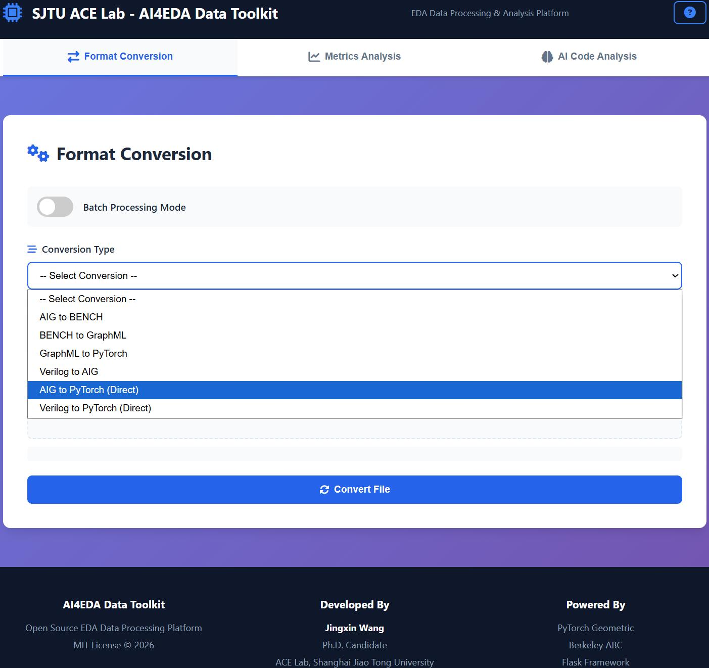
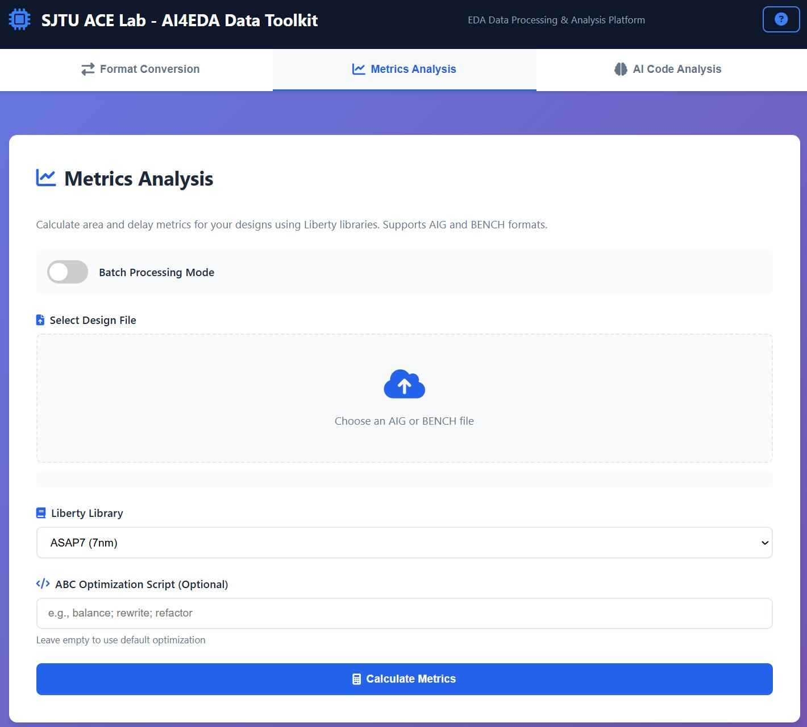
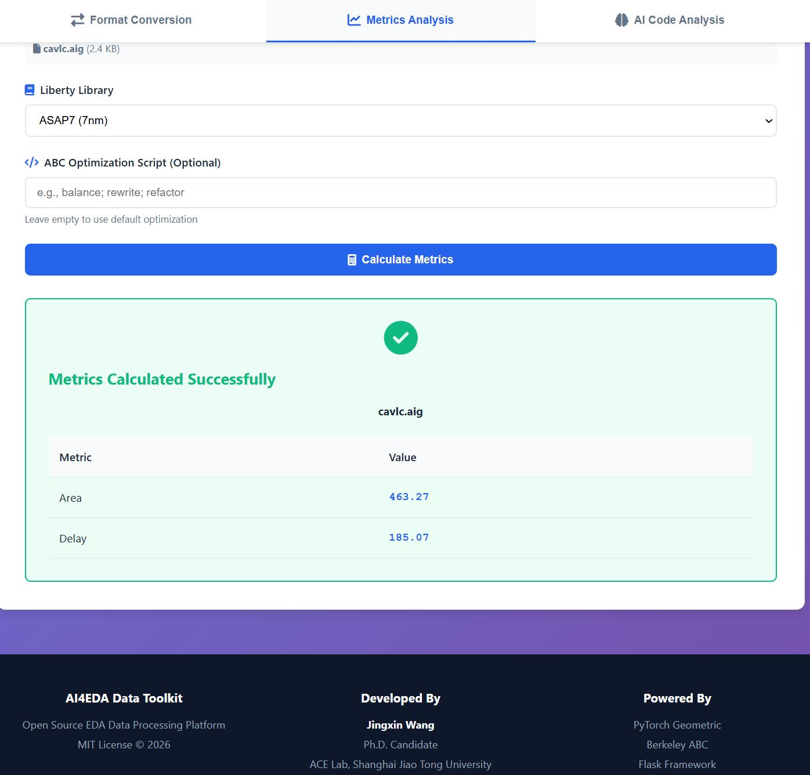
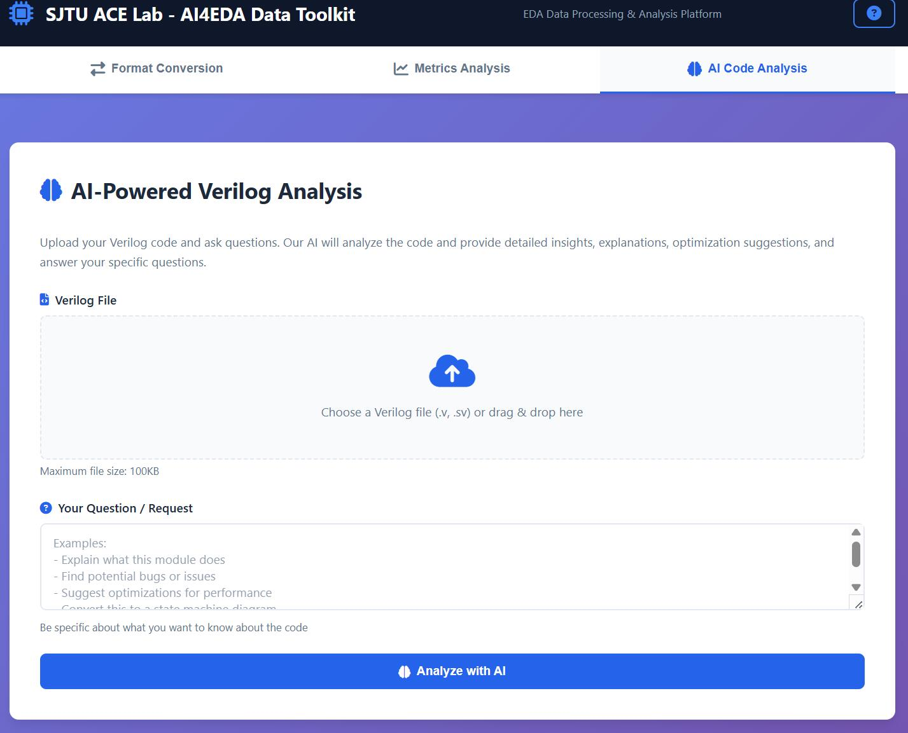
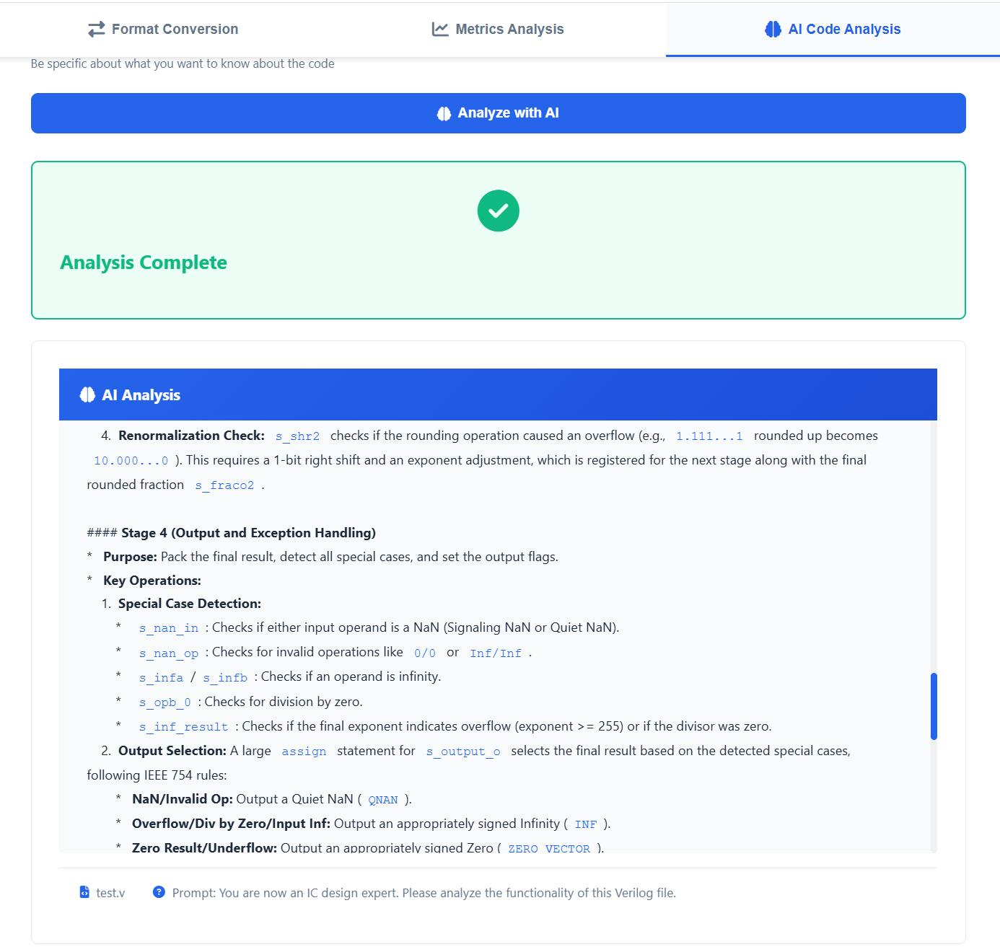

# AI4EDA Data Toolkit

A comprehensive open-source toolkit for EDA (Electronic Design Automation) data processing and format conversion, specifically designed for AI4EDA applications.

**Developed by**: Jingxin Wang (jingxin.wang@sjtu.edu.cn)  
**Affiliation**: ACE Lab, Shanghai Jiao Tong University  
**License**: MIT License

## 🎥 Project Introduction Videos

Watch our comprehensive introduction videos to learn about the AI4EDA Data Toolkit's features, capabilities, and how to get started:

<div align="center">

### 📥 Watch Web Video

[-4A90E2?style=for-the-badge&logo=github&logoColor=white)](https://github.com/959AI994/AI4EDA-OpenABC-Data-Toolkit/raw/main/video/Web-Video.mp4)


### 📥 Watch CLI Video

[-FF6B6B?style=for-the-badge&logo=github&logoColor=white)](https://github.com/959AI994/AI4EDA-OpenABC-Data-Toolkit/raw/main/video/CLI-Video.mp4)

**Click the buttons above to download and watch the videos**

<!-- [](https://bf.ink/s/1njsy3?password=2037)

*Cloud download password: `2037`* -->

</div>

## Vision

As artificial intelligence continues to revolutionize Electronic Design Automation, there is a growing need for standardized, accessible data processing tools that bridge the gap between traditional EDA workflows and modern AI/ML frameworks. The AI4EDA Data Toolkit is built with the vision of:

- **Democratizing AI4EDA Research**: Providing researchers and engineers with easy-to-use tools for converting, processing, and analyzing EDA data in AI-friendly formats
- **Building a Rich Data Ecosystem**: Offering diverse data types and formats to support various AI4EDA applications, from logic synthesis optimization to design space exploration
- **Enabling Rapid Innovation**: Allowing the community to quickly experiment with different data representations and ML approaches without getting bogged down in data preprocessing
- **Fostering Open Collaboration**: Creating an extensible platform where new converters, metrics, and AI-powered analysis tools can be easily integrated

This repository serves as a foundation for the AI4EDA community, providing battle-tested tools for common data processing tasks while remaining flexible enough to accommodate emerging use cases. We are committed to continuously expanding the toolkit with more data types, AI-powered features, and analysis capabilities as the field evolves.

## Quick Navigation

📦 **Choose Your Interface:**
- 🌐 [**Web Version**](#web-version) - User-friendly browser interface with AI-powered analysis (Recommended for quick tasks)
- ⌨️ [**CLI Version**](#features-cli-version) - Command-line tools for automation and batch processing (Recommended for large-scale workflows)

Both versions provide the same powerful functionality - choose based on your workflow preference!

## Web Version

The AI4EDA Data Toolkit provides a modern, user-friendly web interface for EDA data processing. Access all features through your browser with an intuitive interface.

**Web Interface URL**: http://localhost:8080 

### Feature 1: Format Conversion

Convert between different EDA file formats with drag-and-drop support.



**Supported Conversions:**
- AIG to BENCH
- BENCH to GraphML
- GraphML to PyTorch Geometric (.pt)
- Verilog to AIG
- AIG to PyTorch (Direct)
- Verilog to PyTorch (Direct)

**Conversion Results:**

.jpg)

.jpg.jpg)

### Feature 2: Metrics Analysis

Calculate area and delay metrics for your designs using Liberty libraries.



**Features:**
- Area and delay computation
- Support for custom Liberty libraries (ASAP7 included)
- Custom ABC optimization scripts
- Batch processing support

**Metrics Results:**



### Feature 3: AI-Powered Verilog Analysis

Analyze your Verilog code using DeepSeek AI for code understanding, bug detection, and optimization suggestions.



**Capabilities:**
- Code explanation and documentation
- Bug detection and potential issues
- Optimization suggestions
- Design pattern analysis
- Custom questions about your code

**AI Analysis in Action:**


**AI Analysis Results:**



### Getting Started with Web Interface

For detailed instructions on starting and using the web interface, see [web/README.md](web/README.md).


## Features (CLI Version)

- **Format Conversion**
  - AIG to BENCH conversion
  - BENCH to GraphML conversion
  - GraphML to PyTorch Geometric (.pt) conversion
  - Verilog to AIG conversion
  - **AIG to PT (direct)** - One-step conversion from AIG to PyTorch Geometric
  - **Verilog to PT (direct)** - One-step conversion from Verilog to PyTorch Geometric

- **Metrics Calculation**
  - Area and delay computation using Liberty libraries
  - Support for custom ABC optimization scripts

- **Synthesis Recipe Generation**
  - Automatic generation of synthesis optimization sequences
  - Customizable optimization strategies

- **PyTorch Geometric Compatibility**
  - Cross-version PyG data loading
  - Compatible with both old and new PyG formats


## Installation

### Prerequisites

- Python 3.7+
- NetworkX
- PyTorch
- PyTorch Geometric
- ABC tool (see [bin/README.md](bin/README.md) for compilation instructions)

### Install from source

```bash
git clone https://github.com/959AI994/AI4EDA-OpenABC-Data-Toolkit.git
cd AI4EDA-OpenABC-Data-Toolkit
pip install -r requirements.txt
pip install -e .
```

### ⚠️ Important: ABC Compilation Note

If you need to compile ABC from source, **you must modify the ABC source code** before compilation. The `write_bench` function needs to be configured to output **BENCH format** instead of **LUT format**.

**Location**: `abc/src/base/io/ioWriteBenc.c` (the `write_bench` function)

**What to change**: Modify the function to output standard gate-level BENCH format rather than LUT format. This typically involves adjusting the format selection logic within the function.

For detailed instructions, see [bin/README.md](bin/README.md).

<!-- ## Project Structure

```
AI4EDA-OpenABC-Data-Toolkit/
├── ai4eda/                    # Main package
│   ├── converters/            # Format converters
│   │   ├── aig_to_bench.py
│   │   ├── bench_to_graphml.py
│   │   ├── graphml_to_pt.py
│   │   ├── verilog_to_aig.py
│   │   ├── aig_to_pt.py       # Direct AIG→PT conversion
│   │   └── verilog_to_pt.py   # Direct Verilog→PT conversion
│   ├── core/                  # Core functionality
│   │   ├── metrics.py         # Area/delay calculation
│   │   └── synthesis_recipe.py
│   ├── utils/                 # Utilities
│   │   └── pyg_loader.py      # PyG compatibility loader
│   └── cli.py                 # Command-line interface
├── bin/                       # Binary tools
│   ├── abc                    # ABC synthesis tool
│   └── yosys-abc              # Yosys-ABC tool
├── libs/                      # Liberty libraries
│   └── asap7.lib              # ASAP7 library
├── test_data/                 # Test data
│   ├── aig/                   # Sample AIG files
│   ├── verilog/               # Sample Verilog files
│   ├── bench/                 # Generated BENCH files
│   ├── graphml/               # Generated GraphML files
│   └── pt/                    # Generated PT files
└── ai4eda-toolkit             # Main executable script
``` -->

## Usage

You can use the toolkit in two ways:
1. **🌐 Web Interface** (Recommended for beginners) - User-friendly browser-based interface
2. **⌨️ Command-line Interface** (CLI) - For automation and batch processing

<!-- ### 🌐 Web Interface

#### Starting the Web Server

```bash
cd web/
./start_server.sh
```

Or run in the background as a daemon:

```bash
cd web/
./run_daemon.sh start    # Start server
./run_daemon.sh status   # Check status
./run_daemon.sh stop     # Stop server
./run_daemon.sh restart  # Restart server
```

#### Accessing the Web Interface

Once started, open your browser and navigate to:
- **Local:** http://localhost:5000
- **Network:** http://SERVER_IP:5000

#### Using the Web Interface

1. Select the conversion type from the dropdown
2. Upload your file (drag & drop supported)
3. Click "Convert File"
4. Download the converted file -->

### ⌨️ Command-line Interface

The toolkit provides a unified command-line interface:

```bash
ai4eda <command> <subcommand> [options]
```

Or use the direct script:

```bash
./ai4eda-toolkit <command> <subcommand> [options]
```

### Format Conversion

#### AIG to BENCH

Convert a single file:
```bash
ai4eda convert aig2bench input.aig output.bench
```

Batch convert a directory:
```bash
ai4eda convert aig2bench input_dir/ output_dir/ --batch --recursive
```

#### BENCH to GraphML

Convert a single file:
```bash
ai4eda convert bench2graphml input.bench output.graphml
```

Batch convert:
```bash
ai4eda convert bench2graphml input_dir/ output_dir/ --batch --recursive
```

#### GraphML to PyTorch Geometric

Convert a single file:
```bash
ai4eda convert graphml2pt input.graphml output.pt
```

Batch convert:
```bash
ai4eda convert graphml2pt input_dir/ output_dir/ --batch --recursive
```

#### Verilog to AIG

Convert a single file:
```bash
ai4eda convert verilog2aig input.v output.aig
```

With top module specification:
```bash
ai4eda convert verilog2aig input.v output.aig --top-module my_module
```

#### AIG to PT (Direct - One Step)

Convert AIG directly to PyTorch Geometric format without intermediate files:
```bash
ai4eda convert aig2pt input.aig output.pt
```

Keep intermediate files for debugging:
```bash
ai4eda convert aig2pt input.aig output.pt --keep-intermediate
```

Batch convert:
```bash
ai4eda convert aig2pt input_dir/ output_dir/ --batch --recursive
```

#### Verilog to PT (Direct - One Step)

Convert Verilog directly to PyTorch Geometric format:
```bash
ai4eda convert verilog2pt input.v output.pt
```

With top module and keep intermediate files:
```bash
ai4eda convert verilog2pt input.v output.pt --top-module my_module --keep-intermediate
```

Batch convert:
```bash
ai4eda convert verilog2pt input_dir/ output_dir/ --batch --recursive
```

### Metrics Calculation

Calculate area and delay for an AIG file:
```bash
ai4eda metrics input.aig --lib libs/asap7.lib
```

With custom optimization script:
```bash
ai4eda metrics input.aig --lib libs/asap7.lib --opt-script "balance; rewrite; refactor"
```

Batch process:
```bash
ai4eda metrics input_dir/ --lib libs/asap7.lib --batch
```

### Synthesis Recipe Generation

Generate synthesis recipes:
```bash
ai4eda recipe generate input.aig output_dir/ --num-recipes 100
```

With Liberty library:
```bash
ai4eda recipe generate input.aig output_dir/ --num-recipes 100 --lib libs/asap7.lib
```

## Python API

You can also use the toolkit as a Python library:

### Format Conversion

```python
from ai4eda.converters.aig_to_bench import convert_aig_to_bench
from ai4eda.converters.bench_to_graphml import convert_bench_to_graphml
from ai4eda.converters.graphml_to_pt import convert_graphml_to_pt
from ai4eda.converters.aig_to_pt import convert_aig_to_pt
from ai4eda.converters.verilog_to_pt import convert_verilog_to_pt

# Convert AIG to BENCH
success, msg = convert_aig_to_bench("input.aig", "output.bench")

# Convert BENCH to GraphML
success, msg = convert_bench_to_graphml("input.bench", "output.graphml")

# Convert GraphML to PT
success, msg = convert_graphml_to_pt("input.graphml", "output.pt")

# Direct conversion: AIG to PT (one step)
success, msg = convert_aig_to_pt("input.aig", "output.pt")

# Direct conversion: Verilog to PT (one step)
success, msg = convert_verilog_to_pt("input.v", "output.pt", top_module="my_module")
```

### Metrics Calculation

```python
from ai4eda.core.metrics import calculate_metrics

# Calculate area and delay
area, delay, msg = calculate_metrics(
    "design.aig",
    lib_path="libs/asap7.lib",
    opt_script="balance; rewrite"
)
print(f"Area: {area}, Delay: {delay}")
```

### PyG Data Loading (Recommended)

**Best Practice: Use Auto Loader**
```python
from ai4eda.utils.version_compat import load_pt_auto

# Automatically handles all PyG versions and formats
data = load_pt_auto("circuit.pt")

# Extract specific attributes safely
x = data.x
edge_index = data.edge_index
```

**Advanced: Version-Specific Loading**
```python
# For PyG 2.x environments
from ai4eda.utils.pyg_loader import load_pyg_data_compatible, extract_pyg_attr

data = load_pyg_data_compatible("graph.pt")
edge_index = extract_pyg_attr(data, 'edge_index')
node_type = extract_pyg_attr(data, 'node_type')

# For PyG 1.x environments
from ai4eda.utils.pyg_loader_v1 import load_pyg_data_v1

data = load_pyg_data_v1("graph.pt")  # Auto-converts PyG 2.x files
```

## Testing

Run the example workflow:

```bash
# 1. Convert AIG to BENCH
./ai4eda-toolkit convert aig2bench test_data/aig/div.aig test_data/bench/div.bench

# 2. Convert BENCH to GraphML
./ai4eda-toolkit convert bench2graphml test_data/bench/div.bench test_data/graphml/div.graphml

# 3. Convert GraphML to PT
./ai4eda-toolkit convert graphml2pt test_data/graphml/div.graphml test_data/pt/div.pt

# 4. Calculate metrics
./ai4eda-toolkit metrics test_data/aig/div.aig --lib libs/asap7.lib

# 5. Generate synthesis recipes
./ai4eda-toolkit recipe generate test_data/aig/div.aig test_data/recipes --num-recipes 10
```

## PyG Data Structure

The PyTorch Geometric (PyG) data format generated from AIG files represents a complete AIG circuit as a single graph. Each `.pt` file contains one `torch_geometric.data.Data` object that fully represents one AIG circuit.

### Conversion Flow

The conversion from AIG to PyG follows this chain:
**AIG → BENCH → GraphML → PT (PyG)**

Each `.aig` file is converted to one PyG `Data` object representing one complete graph.

### Data Structure Overview

The PyG `Data` object contains the following information:

#### 1. **Graph Structure**

##### `edge_index` (Core Structure)
- **Type**: `torch.LongTensor`
- **Shape**: `[2, E]` where E is the number of edges
- **Meaning**: Represents all edge connections in the graph
- **Format**: 
  ```python
  edge_index = [[source_node_1, source_node_2, ...],
                [target_node_1, target_node_2, ...]]
  ```
- **Example**: If `edge_index = [[0, 1, 2], [1, 2, 3]]`, it represents:
  - Node 0 → Node 1
  - Node 1 → Node 2
  - Node 2 → Node 3

#### 2. **Node Attributes** (Node Features)

Each node contains the following attributes (ordered by node index):

##### `node_id`
- **Type**: `List[str]` or `torch.Tensor`
- **Meaning**: Original identifier of the node (signal name from AIG circuit)
- **Example**: `["a", "b", "n1", "out"]`

##### `node_type`
- **Type**: `torch.LongTensor`
- **Shape**: `[N]` where N is the number of nodes
- **Meaning**: Type of each node
- **Values**:
  - `0`: **PI** (Primary Input) - Primary input node
  - `1`: **PO** (Primary Output) - Primary output node
  - `2`: **Internal** - Internal node (AND gate)
- **Example**: `[0, 0, 2, 1]` means nodes 0 and 1 are inputs, node 2 is internal, and node 3 is output

##### `num_inverted_predecessors`
- **Type**: `torch.LongTensor`
- **Shape**: `[N]`
- **Meaning**: Number of inverted predecessors for this node (how many inputs are inverted via NOT gates)
- **Usage**: Indicates how many inverted signals this node receives

#### 3. **Edge Attributes** (Edge Features)

##### `edge_type`
- **Type**: `torch.LongTensor`
- **Shape**: `[E]` where E is the number of edges
- **Meaning**: Type of each edge, corresponding to the order in `edge_index`
- **Values**:
  - `0`: **BUFF** (Buffer) - Direct connection, no inversion
  - `1`: **NOT** (Inverter) - Inverted connection
- **Example**: If `edge_type = [0, 1, 0]`, it means:
  - 1st edge is BUFF (no inversion)
  - 2nd edge is NOT (inverted)
  - 3rd edge is BUFF (no inversion)

#### 4. **Graph-Level Statistics** (Graph-level Features)

These are global properties of the entire graph:

##### `longest_path`
- **Type**: `torch.LongTensor` or scalar
- **Meaning**: Length of the longest path in the graph (critical path length)

##### `and_nodes`
- **Type**: `torch.LongTensor` or scalar
- **Meaning**: Number of internal AND nodes

##### `pi`
- **Type**: `torch.LongTensor` or scalar
- **Meaning**: Number of Primary Input nodes

##### `po`
- **Type**: `torch.LongTensor` or scalar
- **Meaning**: Number of Primary Output nodes

##### `not_edges`
- **Type**: `torch.LongTensor` or scalar
- **Meaning**: Number of NOT edges

##### `num_nodes`
- **Type**: Integer
- **Meaning**: Total number of nodes in the graph

### How AIG Circuits are Represented

#### Graph Representation

PyG uses **COO (Coordinate) format** (adjacency list) to represent graphs:

1. **Node Numbering**: All nodes are renumbered as `0, 1, 2, ..., N-1`
2. **Edge Representation**: All edge connections are stored via `edge_index`
3. **Node Features**: Each node has corresponding attribute vectors (`node_type`, `num_inverted_predecessors`, etc.)
4. **Edge Features**: Each edge has a corresponding type (`edge_type`)

#### AIG Circuit to Graph Mapping

According to the conversion logic in `bench_to_graphml.py`:

```
AIG Circuit Elements → Graph Nodes/Edges
├── INPUT signals → PI nodes (node_type=0)
├── OUTPUT signals → PO nodes (node_type=1)  
├── AND gates → Internal nodes (node_type=2)
├── Direct connections → BUFF edges (edge_type=0)
└── Inverted connections → NOT edges (edge_type=1)
```

### Data Format Summary

| Field Name | Type | Shape | Meaning |
|------------|------|-------|---------|
| `edge_index` | LongTensor | [2, E] | Edge connections (core graph structure) |
| `node_type` | LongTensor | [N] | Node type (0=PI, 1=PO, 2=Internal) |
| `node_id` | List/Tensor | [N] | Original node identifiers |
| `num_inverted_predecessors` | LongTensor | [N] | Number of inverted predecessors |
| `edge_type` | LongTensor | [E] | Edge type (0=BUFF, 1=NOT) |
| `num_nodes` | int | scalar | Total number of nodes |
| `longest_path` | LongTensor | scalar | Longest path length |
| `pi`, `po`, `and_nodes`, `not_edges` | LongTensor | scalar | Statistics for each node/edge type |

### Example Data Representation

For a simple AIG circuit, the PyG data might look like:

```python
# Graph structure
edge_index = torch.tensor([
    [0, 1, 2, 3],  # Source nodes
    [2, 2, 3, 4]   # Target nodes
], dtype=torch.long)
# Represents: 0→2, 1→2, 2→3, 3→4

# Node attributes
node_type = torch.tensor([0, 0, 2, 2, 1])  # PI, PI, Internal, Internal, PO
node_id = ["a", "b", "n1", "n2", "out"]
num_inverted_predecessors = torch.tensor([0, 0, 0, 1, 0])

# Edge attributes
edge_type = torch.tensor([0, 0, 0, 0])  # All BUFF edges

# Graph statistics
num_nodes = 5
pi = 2
po = 1
and_nodes = 2
```

This representation fully captures the structure and properties of AIG circuits, making it suitable for graph neural networks to perform circuit analysis and optimization tasks.

## Advanced Features

### PyTorch Geometric Version Compatibility

The toolkit provides **full backward compatibility** for PyTorch Geometric data files, supporting all cross-version loading scenarios:

| Your Environment | Load PyG 1.x Data | Load PyG 2.x Data |
|------------------|-------------------|-------------------|
| **PyG 2.x**      | ✅ Supported      | ✅ Supported      |
| **PyG 1.x**      | ✅ Supported      | ✅ **Supported** (auto-converts) |

#### Recommended: Use Auto Loader

The easiest way is to use the automatic loader that detects your PyG version and handles conversions automatically:

```python
from ai4eda.utils.version_compat import load_pt_auto

# Works in both PyG 1.x and 2.x environments
# Automatically detects and converts if needed
data = load_pt_auto("circuit.pt")
```

#### Manual Version-Specific Loading

If you know your environment, you can use version-specific loaders:

**For PyG 2.x environments:**
```python
from ai4eda.utils.pyg_loader import load_pyg_data_compatible

# Load any PT file (PyG 1.x or 2.x format)
data = load_pyg_data_compatible("circuit.pt")
```

**For PyG 1.x environments (e.g., openabc conda env):**
```python
from ai4eda.utils.pyg_loader_v1 import load_pyg_data_v1

# Load any PT file, automatically converts PyG 2.x format if needed
data = load_pyg_data_v1("circuit.pt")
# If the file was generated by PyG 2.x, you'll see:
# "Detected PyG 2.x format data, converting to PyG 1.x format..."
```

#### Common Use Case: Mixed Environment Workflow

**Development with PyG 2.x:**
```bash
# Generate PT files using modern PyG 2.x
ai4eda convert graphml2pt circuits/ output/
```

**Deployment with PyG 1.x (legacy systems/openabc):**
```python
# Load the same files in older PyG 1.x environment
from ai4eda.utils.version_compat import load_pt_auto

# Automatically handles the version difference!
data = load_pt_auto("output/circuit.pt")
```

#### Check Your PyG Version

To verify your environment and get recommendations:

```bash
python -m ai4eda.utils.version_compat
```

Output example:
```
============================================================
PyG Environment Information
============================================================
PyTorch version: 1.10.0
PyG version: 1.7.2
PyG major version: 1.x

✓ PyG 1.x detected
  Recommended loader: pyg_loader_v1
  Recommended converter: graphml_to_pt_v1
============================================================
```

### Batch Processing

All conversion tools support batch processing:

```python
from ai4eda.converters.aig_to_bench import AigToBenchConverter

converter = AigToBenchConverter()
stats = converter.convert_batch(
    input_dir="designs/aig/",
    output_dir="designs/bench/",
    recursive=True
)
print(f"Converted {stats['success']}/{stats['total']} files")
```

## Tools Included

- **ABC**: Berkeley ABC synthesis tool (v1.0)
- **Yosys-ABC**: Yosys integrated ABC tool
- **ASAP7 Library**: 7nm ASAP library for technology mapping

## Directory Structure for Data

Recommended directory structure for your data:

```
your_project/
├── raw/
│   ├── verilog/          # Original Verilog files
│   └── aig/              # AIG files
├── processed/
│   ├── bench/            # BENCH format
│   ├── graphml/          # GraphML format
│   └── pt/               # PyTorch Geometric format
├── recipes/              # Synthesis recipes
└── metrics/              # Calculated metrics
```

## Performance Tips

1. **Batch Processing**: Use `--batch` flag for processing multiple files
2. **Recursive Search**: Use `--recursive` to process nested directories
3. **Timeout Settings**: Adjust timeout for large designs in Python API
4. **Parallel Processing**: The toolkit uses efficient parallel processing for batch operations

## Troubleshooting

### ABC Tool Not Found

Make sure the ABC binary is in the `bin/` directory or specify path:
```bash
ai4eda convert aig2bench input.aig output.bench --abc-path /path/to/abc
```

### PyTorch Geometric Import Error

Install PyG following official instructions:
```bash
pip install torch-geometric
```

### PyG Version Compatibility Issues

If you encounter errors loading PT files across different PyG versions:

**Error: "Can't get attribute 'DataEdgeAttr'"**
- This means you're loading a PyG 2.x file in a PyG 1.x environment
- **Solution**: Use the auto loader which handles conversion automatically:
```python
from ai4eda.utils.version_compat import load_pt_auto
data = load_pt_auto("file.pt")  # Automatically converts!
```

**Check your PyG version:**
```bash
python -c "import torch_geometric; print(torch_geometric.__version__)"
```

**Verify compatibility:**
```bash
python -m ai4eda.utils.version_compat
```

### Liberty Library Issues

Ensure the liberty file exists:
```bash
ls libs/asap7.lib
```

## Contributing

Contributions are welcome! Please feel free to submit pull requests or open issues.

## License

This project is licensed under the MIT License - see the [LICENSE](LICENSE) file for details.

Copyright (c) 2026 Jingxin Wang, ACE Lab, Shanghai Jiao Tong University

## Citation

If you use this toolkit in your research, please cite:

```bibtex
@software{ai4eda_toolkit,
  title={AI4EDA Data Toolkit},
  author={Jingxin Wang},
  year={2026},
  institution={Global College, Shanghai Jiao Tong University},
  url={https://github.com/959AI994/AI4EDA-OpenABC-Data-Toolkit}
}
```

## Acknowledgments

- Berkeley ABC team for the ABC synthesis tool
- YosysHQ for Yosys-ABC integration
- PyTorch Geometric team for the graph learning framework
- OpenABC project for dataset inspiration

## Contact

**Email**: jingxin.wang@sjtu.edu.cn
For questions and feedback, please:
- Open an issue on GitHub
- Contact via email for research collaboration

---

**Note**: This toolkit is designed for research and educational purposes. For production use, please ensure proper testing and validation.
